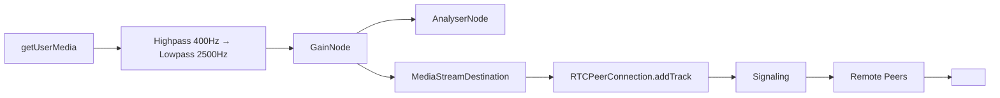

# Phase 3: Real-Time Communication, User Profiles & Mobile UX Overhaul

**Status:** Planning | **Branch:** `phase3-plan` | **Based on:** `main` (commit: current)

---

## Executive Summary

Phase 3 transforms PopTalk from a **local-only demo** into a **production-ready multi-user walkie-talkie** with WebRTC audio streaming, persistent user profiles, and a fully responsive mobile-first architecture.

**Current State:**
- ✅ Audio Engine (Web Audio API) — `useRadioAudio.ts`
- ✅ Control Plane (REST API) — `useRadioBackend.ts` + Laravel backend
- ✅ Auth (Sanctum) — Login/Register + session persistence
- ❌ **Real-time media relay** — WebRTC not implemented
- ❌ **User profiles** — No avatar, bio, theme, or preferences
- ❌ **Mobile routes** — Single `RadioRoom.vue` handles all breakpoints via CSS only

---

## 1. Real-Time WebRTC Audio (Core Phase 3)

### 1.1 Architecture Decision: Pusher + WebRTC Mesh

| Layer | Technology | Rationale |
|-------|------------|-----------|
| **Signaling** | Pusher (Laravel Reverb) | Already in `backend/composer.json`; channels + presence |
| **Media Transport** | WebRTC Mesh (peer-to-peer) | Sub-100ms latency; no SFU cost for ≤10 peers/channel |
| **Fallback** | TURN (coturn) | NAT traversal; deploy separately or use managed |

> **Why not LiveKit/PeerJS?** Pusher/Reverb is already provisioned. Mesh avoids SFU complexity for v1. Can migrate to SFU later if channel sizes grow.

### 1.2 Signaling Contract (Pusher Events)

```typescript
// Client → Server (via Pusher client events or API)
interface PTTStartEvent { channel: number; sessionId: string; sdp: RTCSessionDescriptionInit }
interface PTTStopEvent  { channel: number; sessionId: string; transmissionId: string }
interface IceCandidateEvent { channel: number; targetSessionId: string; candidate: RTCIceCandidateInit }

// Server → Client (Pusher presence channel: `presence-frequency.{channel}`)
interface OperatorJoinedEvent  { operator: OperatorPayload; frequency: number }
interface OperatorLeftEvent    { operatorId: string; frequency: number }
interface PTTStartedEvent      { operator: OperatorPayload; transmissionId: string; sdp: RTCSessionDescriptionInit }
interface PTTStoppedEvent      { operatorId: string; transmissionId: string }
interface IceCandidateRelay    { from: string; to: string; candidate: RTCIceCandidateInit }
```

### 1.3 Frontend Integration Points

| Existing Composables | New Responsibility |
|---------------------|-------------------|
| `useRadioAudio.ts` | Expose `processedStream` (MediaStream) for `addTrack()`; add `replaceTrack()` for mute/unmute |
| `useRadioBackend.ts` | Add `joinFrequency(channel)`, `leaveFrequency()`, `startPTTWebRTC()`, `stopPTTWebRTC()`; listen to Pusher presence events |
| `RadioRoom.vue` | Wire PTT button → `claimFloor` → WebRTC `createOffer` → Pusher signal → peer connections |

### 1.4 WebRTC Implementation Tasks

- [ ] **`useWebRTC.ts`** composable
  - `RTCPeerConnection` factory (STUN: `stun:stun.l.google.com:19302`, TURN from env)
  - Mesh management: `peers: Map<string, RTCPeerConnection>`
  - `addLocalTrack(MediaStreamTrack)`, `removeLocalTrack()`
  - `createOffer(targetId)`, `handleAnswer(targetId, sdp)`, `handleIceCandidate(targetId, candidate)`
  - `ontrack` → play remote audio via `<audio>` element pool (reuse for multiple peers)
  - `onconnectionstatechange` → update UI peer status
- [ ] **Pusher client setup** in `useRadioBackend.ts`
  - `Echo.join(\`presence-frequency.${channel}\`)`
  - Listen for `here`, `joining`, `leaving`, `ptt-start`, `ptt-stop`, `ice-candidate`
  - Emit client events for signaling (or use API endpoints for auth)
- [ ] **Backend PTT Controller** (`PttController.php`)
  - `start()`: validate floor, broadcast `PTTStartedEvent` with initiator's SDP offer
  - `stop()`: broadcast `PTTStoppedEvent`, cleanup transmission record
- [ ] **ICE Candidate Relay** (API + Pusher)
  - `POST /api/v1/frequencies/{freq}/ice-candidates` → broadcast to target

### 1.5 Audio Pipeline Changes



- `useRadioAudio.ts`: `processedStream.value` already outputs filtered `MediaStream` ✓
- Add `getAudioTrack()` helper returning the first audio track from `processedStream`
- On `startTransmission()`: `peerConnection.addTrack(track, stream)`
- On `stopTransmission()`: `sender.replaceTrack(null)` (keeps connection warm)

---

## 2. User Profile Customization

### 2.1 Data Model (Backend)

```php
// migration: add_profile_fields_to_users_table
$table->string('avatar_url')->nullable()->after('callsign');
$table->text('bio')->nullable()->after('avatar_url');
$table->json('preferences')->nullable()->after('bio'); // { theme, notifications, audio }
$table->string('timezone', 64)->default('UTC')->after('preferences');
```

### 2.2 API Endpoints

| Method | Endpoint | Description |
|--------|----------|-------------|
| `GET` | `/api/v1/me/profile` | Full profile (avatar, bio, preferences, stats) |
| `PATCH` | `/api/v1/me/profile` | Update profile (multipart for avatar) |
| `GET` | `/api/v1/operators/{uuid}` | Public profile view |
| `POST` | `/api/v1/me/avatar` | Upload avatar → return signed URL (S3/local) |

### 2.3 Frontend: Profile Page & Settings

**New Routes:**
- `/profile` — Own profile (edit mode)
- `/profile/:uuid` — Public profile view

**New Components:**
- `ProfileHeader.vue` — Avatar upload, callsign, bio, stats (transmissions, hours, channels visited)
- `ProfileSettings.vue` — Tabs: Appearance, Audio, Notifications, Account
- `AvatarUploader.vue` — Drag-drop, crop (1:1), preview, remove

**Preferences Schema:**
```typescript
interface UserPreferences {
  theme: 'classic' | 'neon' | 'noir' | 'high-contrast';
  audio: {
    radioEffect: boolean;
    soundEffects: boolean;
    inputGain: number;      // 0.0–2.0
    outputVolume: number;   // 0.0–1.0
    noiseGate: number;      // -60 to 0 dB
  };
  notifications: {
    pttStart: boolean;
    pttEnd: boolean;
    channelBusy: boolean;
    mentions: boolean;
  };
  ui: {
    reduceMotion: boolean;
    compactMode: boolean;
    showHalftone: boolean;
  };
}
```

---

## 3. Route Separation & Mobile-First Architecture

### 3.1 Current Problem

`RadioRoom.vue` (763 lines) is a **God component** handling:
- Desktop three-column layout
- Mobile stacked layout (via CSS `@media`)
- Auth gating, PTT logic, settings, activity log, channel tuning

### 3.2 New Route Structure

| Route | Component | Purpose | Breakpoint Behavior |
|-------|-----------|---------|---------------------|
| `/` | `Dashboard.vue` | Landing: channel list, quick join, recent activity | Mobile: card stack; Desktop: grid |
| `/channel/:number` | `ChannelRoom.vue` | Active PTT room (was `RadioRoom`) | Mobile: full-screen PTT; Desktop: 3-col |
| `/channel/:number/settings` | `ChannelSettings.vue` | Channel-specific prefs (notifications, auto-join) | Modal on mobile, sidebar on desktop |
| `/profile` | `ProfilePage.vue` | Own profile editor | Full screen |
| `/profile/:uuid` | `PublicProfile.vue` | Read-only profile | Card overlay mobile, page desktop |
| `/settings` | `SettingsPage.vue` | Global app settings | Tabbed |
| `/directory` | `OperatorDirectory.vue` | Browse operators by channel/activity | Searchable list |

### 3.3 Component Extraction (from `RadioRoom.vue`)

| New Component | Extracted From | Props/Emits |
|---------------|----------------|-------------|
| `ChannelTuner.vue` | Already exists | `modelValue: number`, `disabled`, `@update:modelValue` |
| `PushToTalk.vue` | Already exists | `held`, `transmitting`, `pending`, `disabled`, `@press-start`, `@press-end` |
| `SignalMeter.vue` | Already exists | `bars`, `level`, `active` |
| `StatusBanner.vue` | Lines 508–528 | `status`, `channel`, `callsign`, `tone` |
| `SpeakerBlock.vue` | Lines 542–556 | `speaker`, `peerCount`, `busy` |
| `StationCard.vue` | Lines 622–674 | `session`, `microphoneState`, `onArm`, `onDisarm` |
| `SettingsCard.vue` | Lines 676–726 | `callsign`, `radioEffect`, `soundEffects`, `@update:*` |
| `ActivityLog.vue` | Lines 728–749 | `items`, `maxItems` |
| `ConnectionAlert.vue` | Lines 581–618 | `state`, `error`, `@retry` |
| `MicAlert.vue` | Lines 597–618 | `state`, `error`, `@retry` |

### 3.4 Layout System

```typescript
// composables/useLayout.ts
export function useLayout() {
  const isMobile = ref(false)
  const isTablet = ref(false)
  const breakpoint = ref<'mobile' | 'tablet' | 'desktop'>('desktop')

  onMounted(() => {
    const mqMobile = window.matchMedia('(max-width: 640px)')
    const mqTablet = window.matchMedia('(max-width: 1024px)')
    const update = () => {
      isMobile.value = mqMobile.matches
      isTablet.value = mqTablet.matches && !mqMobile.matches
      breakpoint.value = isMobile.value ? 'mobile' : isTablet.value ? 'tablet' : 'desktop'
    }
    update()
    mqMobile.addEventListener('change', update)
    mqTablet.addEventListener('change', update)
    onBeforeUnmount(() => {
      mqMobile.removeEventListener('change', update)
      mqTablet.removeEventListener('change', update)
    })
  })

  return { isMobile, isTablet, breakpoint }
}
```

**Responsive Patterns:**
- Mobile: Single column, bottom sheets for settings, full-screen modals
- Tablet: Two-column (PTT + tuner | side stack), collapsible sidebar
- Desktop: Three-column (current), persistent sidebar

---

## 4. Minor Improvements & Polish

### 4.1 Accessibility (WCAG 2.1 AA)

- [ ] Focus management: Trap focus in modals/sheets; restore on close
- [ ] ARIA live regions for status changes (already partially done)
- [ ] Keyboard shortcuts: `Space` (PTT), `←/→` (channel), `?` (help), `Esc` (close)
- [ ] Reduced motion: Respect `prefers-reduced-motion` (CSS done, add JS checks)
- [ ] Color contrast: Verify all text meets 4.5:1 (current: mostly OK, check alerts)

### 4.2 PWA & Offline Support

- [ ] `vite-plugin-pwa` — Service worker, manifest, install prompt
- [ ] Cache: Static assets (CSS, JS, fonts), fallback offline page
- [ ] Background sync: Queue PTT actions when offline, replay on reconnect
- [ ] `beforeinstallprompt` handler → custom "Install App" banner

### 4.3 Performance

- [ ] Code-split routes: `defineAsyncComponent(() => import('./views/ChannelRoom.vue'))`
- [ ] Lazy-load heavy components: `SignalMeter`, `ActivityLog`, `SettingsCard`
- [ ] Virtualize `ActivityLog` list (max 50 items, already sliced)
- [ ] Debounce `channel`/`callsign` localStorage writes (already 300ms)

### 4.4 Error Handling & Resilience

- [ ] Global error boundary: `app.config.errorHandler` → toast + Sentry
- [ ] WebRTC reconnection: Exponential backoff (1s, 2s, 4s, 8s, max 30s)
- [ ] MediaStream recovery: On `track.ended`, re-request `getUserMedia` silently
- [ ] Pusher connection monitor: Show "Reconnecting…" banner, auto-rejoin channel

### 4.5 Developer Experience

- [ ] TypeScript strict mode (already enabled via `vue-tsc --build`)
- [ ] Vitest coverage: Target ≥80% for composables, ≥60% for components
- [ ] Storybook: Document `PushToTalk`, `ChannelTuner`, `SignalMeter`, `StatusBanner`
- [ ] ESLint + Prettier: Add `@vue/eslint-config-typescript`, format on save

---

## 5. Implementation Phasing (Suggested Sprint Breakdown)

| Sprint | Focus | Deliverables |
|--------|-------|--------------|
| **3.1** | WebRTC Foundation | `useWebRTC.ts`, Pusher signaling, mesh for 2 peers, audio relay |
| **3.2** | WebRTC Harden | TURN, ICE restart, multi-peer (≤10), connection state UI, reconnection |
| **3.3** | Profile System | Backend migration + API, `ProfilePage`, `AvatarUploader`, preferences sync |
| **3.4** | Route Split | Extract components, new routes, `Dashboard`, `ChannelRoom`, layout composable |
| **3.5** | Mobile Polish | Bottom sheets, touch targets (44×44), PWA, install prompt, offline queue |
| **3.6** | Accessibility & Perf | Focus traps, keyboard nav, code-split, virtualization, error boundary |

---

## 6. Open Questions for User

1. **Avatar Storage**: Local (`public/storage`) or S3-compatible (MinIO/R2/S3)?
2. **TURN Server**: Self-hosted coturn, or managed (Twilio, Metered, Cloudflare)?
3. **Channel Capacity**: Target max peers per channel? (Mesh: ~10–15; SFU needed beyond)
4. **Profile Privacy**: Public by default, or opt-in? Block/mute operators?
5. **Theme Variants**: Implement all 4 themes now, or ship `classic` + `high-contrast` first?
6. **Push Notifications**: Web Push API (VAPID) for "Channel busy" / mentions when tab backgrounded?
7. **Testing**: Cypress E2E for PTT flows, or rely on Vitest + manual QA?

---

## 7. Risk Assessment

| Risk | Likelihood | Impact | Mitigation |
|------|------------|--------|------------|
| WebRTC mesh doesn't scale | Medium | High | Design for SFU migration; limit channel size in UI |
| Pusher/Reverb connection drops | Low | High | Exponential backoff + presence rejoin; show status |
| Mobile audio autoplay blocked | High | Medium | Require user gesture before `startTransmission`; guide user |
| Avatar upload abuse | Low | Medium | Validate MIME, max 2MB, resize server-side, signed URLs |
| iOS Safari WebRTC quirks | High | Medium | Test early; fallback to relay via TURN; log `RTCStats` |

---

## 8. Definition of Done (Phase 3)

- [ ] **WebRTC**: 2+ users on same channel hear each other <150ms latency (measured via `RTCStatsReport`)
- [ ] **Profiles**: User can upload avatar, edit bio, change theme; persists across sessions
- [ ] **Routes**: All 7 routes accessible, mobile-first, no horizontal scroll <375px
- [ ] **PWA**: Installable, works offline (cached shell), updates via SW
- [ ] **A11y**: Passes `axe-core` automated audit; manual keyboard/screen reader test
- [ ] **Tests**: ≥80% composable coverage; E2E happy path (login → join → talk → leave)
- [ ] **Docs**: Updated `README.md`, `AGENTS.md`, component storybook

---

## Next Steps

1. **User reviews plan** → Approve / request changes
2. **Create branch** `phase3-webrtc` → Sprint 3.1
3. **Set up Pusher/Reverb** locally (Docker) + TURN credentials
4. **Implement `useWebRTC.ts`** with single-peer test
5. **Iterate**

---

*Generated: 2026-09-05 | Based on codebase analysis of `poptalk/frontend` + `poptalk/backend`*